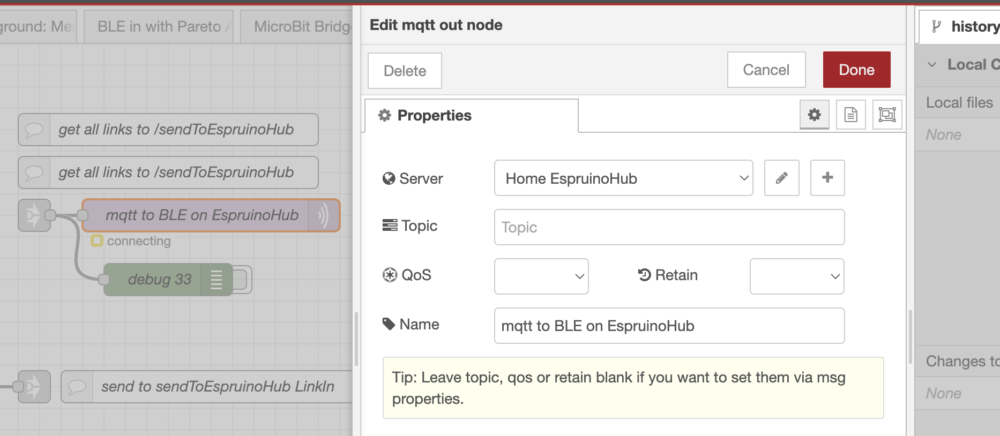

# BLE Out Bridge Installation with EspruinoHub

The BLE Out Bridge allows you to send messages to BLE devices that are able to receive them, such as the Espruino family of devices (Puck, Bangle, JoltJS, etc).

What cool with these devices is that you can literally send them strings of javascript code that they will immeidately run!

This code can include calls to functions you've created on the devices.

Sounds super secure, right? I dunno, I guess just don't use them to run nuclear power plants?

# Installation
This setup requires a separate Raspberry Pi computer that isn't using Bluetooth for anything else.

Or, you could perhaps use a bluetooth dongle, but I haven't tried that.

## Set up a Raspberry Pi or similar computer with Node-RED and Pareto Anywhere

Using Raspberry Pi Imager, create an image of:

__Raspbian Lite, with ssh enabled__

(Download Raspberry Pi Imageer and check out more thorough instructions for use at
this link: https://www.raspberrypi.com/software/)

Once you've logged into your Pi, run:

`ifconfig`

Note your IP address, you'll need it later :) 


## Install all the stuff
```
sudo apt update
sudo apt upgrade
sudo apt install -y python-rpi.gpio git-core
sudo apt install -y mosquitto mosquitto-clients bluetooth bluez libbluetooth-dev libudev-dev
cd ~/.node-red && npm install node-red-contrib-ui
cd ~/
git clone https://github.com/espruino/EspruinoHub
cd EspruinoHub
npm install
npm install @abandonware/bluetooth-hci-socket
sudo setcap cap\_net\_raw+eip $(eval readlink -f \`which node\`)
sudo cp systemd-EspruinoHub.service /etc/systemd/system/EspruinoHub.service
sudo systemctl enable EspruinoHub.service
sudo systemctl start EspruinoHub.service
```
you should now be able to see an interface running at:
 http://[THIS RPI IP ADDRESS]:1888/
 
## Configure the Mqtt node in Node-RED 
in the BLE OUT Bridge, you need to configure the node named "mqtt to BLE on EspruinoHub" to point to your new EspruinoHub installation

Double click on it


click on the pencil next to "Home EspruinoHub" 
(that name is left over from me setting up multiple EspruinoHubs, one of which was running in my apartment. You can create your own if you want, or edit this one)

You'll then see this window:


Change the IP address next to "Server" to match the IP of the server you set up to run EspruinoHub.

Once that's done, you can try sending messages to an Espruino Device by modifying the sample flow to match your own device's ID, and sending valid javascript code to the friendly-named input, as in the example on the Switchboard tab.
